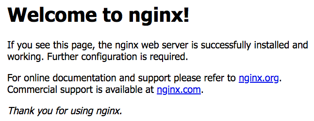

# 在 Mac 安裝 Docker


## 系統需求

1. Mac hardware must be a 2010 or newer model, with Intel’s hardware support for memory management unit (MMU) virtualization, including Extended Page Tables (EPT) and Unrestricted Mode. You can check to see if your machine has this support by running the following command in a terminal: sysctl kern.hv_support

2. macOS El Capitan 10.11 and newer macOS releases are supported. We recommend upgrading to the latest version of macOS.

3. At least 4GB of RAM

4. VirtualBox prior to version 4.3.30 must NOT be installed (it is incompatible with Docker for Mac). If you have a newer version of VirtualBox installed, it’s fine.

## 安裝

從 [Docker Community Edition for Mac - Docker Store](https://store.docker.com/editions/community/docker-ce-desktop-mac) 下載後，直接點選 `Docker.dmg` 檔案，然後將 docker 拖曳到 Application 即可

> 過程中需要輸入密碼，需要管理者權限存取系統資料


## 開啟 Docker

在 Spotlight 輸入 Docker 可以找到剛剛安裝的 Docker，按下 Enter 即可執行


開啟後可以在上方工具列看到 docker 圖示，表示正常運行 docker 了


## docker 版本檢查

啟動 Docker 後，就可以在終端機檢查 Docker 版本了

```shell
$ docker --version

Docker version 18.03.1-ce, build 9ee9f40
```

```shell
$ docker-compose --version

docker-compose version 1.21.1, build 5a3f1a3
```

```shell
$ docker-machine --version

docker-machine version 0.14.0, build 9ba6da9
```

```shell
$ docker info

Containers: 9
 Running: 1
 Paused: 0
 Stopped: 8
Images: 283
Server Version: 18.03.1-ce
Storage Driver: overlay2
 Backing Filesystem: extfs
 Supports d_type: true
 Native Overlay Diff: true
Logging Driver: json-file
Cgroup Driver: cgroupfs
Plugins:
 Volume: local
 Network: bridge host ipvlan macvlan null overlay
 Log: awslogs fluentd gcplogs gelf journald json-file logentries splunk syslog
Swarm: inactive
Runtimes: runc
Default Runtime: runc
Init Binary: docker-init
containerd version: 773c489c9c1b21a6d78b5c538cd395416ec50f88
runc version: 4fc53a81fb7c994640722ac585fa9ca548971871
init version: 949e6fa
Security Options:
 seccomp
  Profile: default
Kernel Version: 4.9.87-linuxkit-aufs
Operating System: Docker for Mac
OSType: linux
Architecture: x86_64
CPUs: 2
Total Memory: 1.952GiB
Name: linuxkit-025000000001
ID: H5MW:RZPI:2L7N:6L5K:5JN2:UV6V:23LL:NJ5H:HLN2:CU47:QUPK:EJTA
Docker Root Dir: /var/lib/docker
Debug Mode (client): false
Debug Mode (server): true
 File Descriptors: 30
 Goroutines: 56
 System Time: 2018-06-14T07:30:10.9003582Z
 EventsListeners: 2
HTTP Proxy: docker.for.mac.http.internal:3128
HTTPS Proxy: docker.for.mac.http.internal:3129
Registry: https://index.docker.io/v1/
Labels:
Experimental: true
Insecure Registries:
 127.0.0.0/8
Live Restore Enabled: false
```

## 執行 docker Nginx Web Server

輸入 `docker run` 執行一個 Nginx Web Server

```shell
docker run -d -p 80:80 --name webserver nginx
```

執行後到 [http://localhost](http://localhost) 如果可以看到 *Welcome to nginx!* 表示安裝成功了



## 移除 docker Nginx Web Server

```shell
$ docker stop webserver
$ docker rm webserver
```

所有的 docker container 在移除之前都需要透過 `docker stop` 指令將其停止，才能透過 `docker rm` 將其移除

```shell
$ docker ps -a
CONTAINER ID        IMAGE               COMMAND                  CREATED             STATUS              PORTS                NAMES
dd5978a2cf0a        nginx               "nginx -g 'daemon of…"   3 minutes ago       Up 3 minutes        0.0.0.0:80->80/tcp   webserver
```

可以透過 `docker ps -a` 看到目前所有的 container，在做 `docker stop` 或 `docker rm` 時，可以根據他的 `CONTAINER ID` 或 `NAME` 去做移除

```shell
$ docker stop webserver
$ docker rm webserver

$ docker stop dd5978a2cf0a
$ docker rm dd5978a2cf0a
```


## `docker stop` 與 `docker rm` 的差異

### `docker stop` 停止

停止 container 並保留在 `docker ps -a` 的清單中，讓你有機會可以去做 commit，產生一個全新的 container

### `docker rm` 移除

移除已經停止的 container，在 `docker ps -a` 的清單將看不到這個 container

在 container 執行中時，是無法使用 `docker rm` 指令去移除，必須要先用 `docker stop` 停止 container 後才能移除

若要強制移除執行中的 container，可以加入 `-f` 參數強制移除他

```shell
$ docker rm -f <CONTAINER_ID>
```

## 移除所有 container

```shell
docker stop $(docker ps -a -q)
docker rm $(docker ps -a -q)
```


## 參考資料
* [Get started with Docker for Mac | Docker Documentation](https://docs.docker.com/docker-for-mac/)
* [Install Docker for Mac | Docker Documentation](https://docs.docker.com/docker-for-mac/install/)
* [Docker Community Edition for Mac - Docker Store](https://store.docker.com/editions/community/docker-ce-desktop-mac)
* [What's the difference between "docker stop" and "docker rm"? - Stack Overflow](https://stackoverflow.com/questions/33362856/whats-the-difference-between-docker-stop-and-docker-rm)
* [single command to stop and remove docker container - Stack Overflow](https://stackoverflow.com/questions/35122773/single-command-to-stop-and-remove-docker-container)
* [docker stop | Docker Documentation](https://docs.docker.com/engine/reference/commandline/stop/)
* [docker rm | Docker Documentation](https://docs.docker.com/engine/reference/commandline/rm/)
* [Stop / remove all Docker containers (Example)](https://coderwall.com/p/ewk0mq/stop-remove-all-docker-containers)
