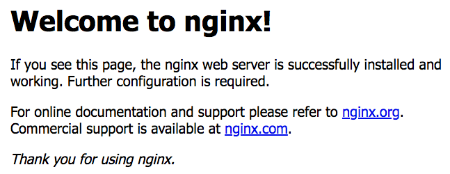

# 連接埠 port


## 綁定 port

```shell
docker run -d -p <本地端 port>:<Container port> <資源庫名稱 REPOSITORY>:<標籤 TAG>
```

```shell
$ docker run -d -p 5000:80 --name webserver nginx
```

執行後到 [http://localhost:5000/](http://localhost:5000/) 如果可以看到 *Welcome to nginx!* 表示綁定成功了




## 查詢綁定 port

**指令**

```shell
$ docker port <CONTAINER ID / CONTAINER NAMES>
```

**查詢**

```shell
$ docker ps
CONTAINER ID        IMAGE               COMMAND                  CREATED                  STATUS              PORTS                  NAMES
4119a39aee45        nginx               "nginx -g 'daemon of…"   Less than a second ago   Up 7 seconds        0.0.0.0:5000->80/tcp   webserver
```

```shell
$ docker port 4119a39aee45
80/tcp -> 0.0.0.0:5000

$ docker port webserver
80/tcp -> 0.0.0.0:5000
```
