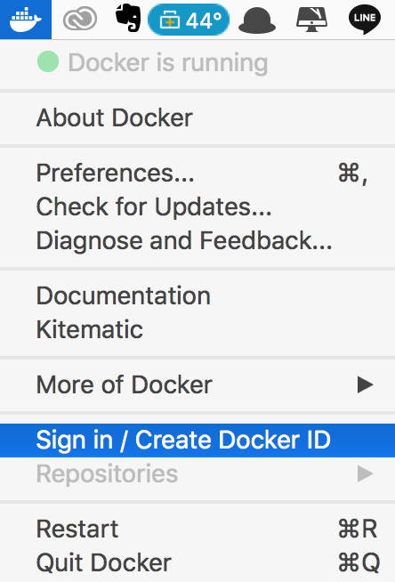
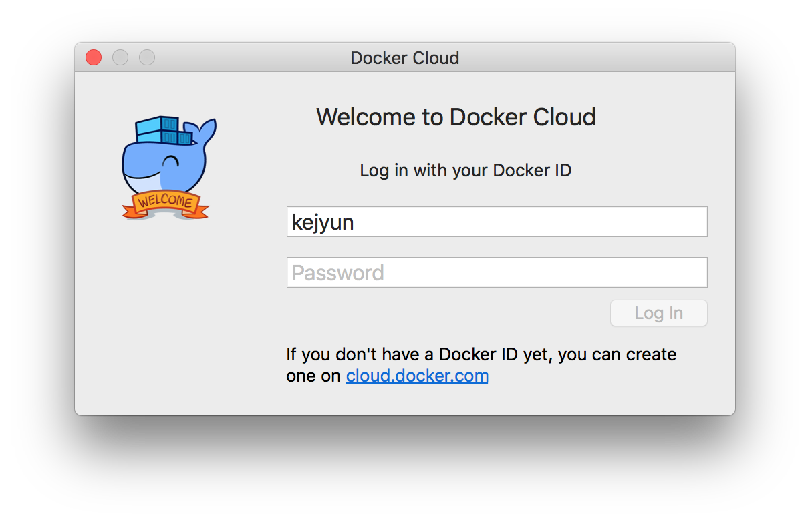

# Docker Hub

## 搜尋資源庫映像檔

```shell
$ docker search <關鍵字>
```

```shell
$ docker search ubuntu
NAME                                                      DESCRIPTION                                     STARS               OFFICIAL            AUTOMATED
ubuntu                                                    Ubuntu is a Debian-based Linux operating sys…   7815                [OK]
dorowu/ubuntu-desktop-lxde-vnc                            Ubuntu with openssh-server and NoVNC            188                                     [OK]
rastasheep/ubuntu-sshd                                    Dockerized SSH service, built on top of offi…   156                                     [OK]
ansible/ubuntu14.04-ansible                               Ubuntu 14.04 LTS with ansible                   93                                      [OK]
ubuntu-upstart                                            Upstart is an event-based replacement for th…   87                  [OK]
neurodebian                                               NeuroDebian provides neuroscience research s…   50                  [OK]
ubuntu-debootstrap                                        debootstrap --variant=minbase --components=m…   38                  [OK]
```

### 搜尋條件

使用 --filter 可以過濾搜尋條件

**搜尋星星數大於 100 的映像檔**

```shell
$ docker search ubuntu --filter=stars=100
NAME                             DESCRIPTION                                     STARS               OFFICIAL            AUTOMATED
ubuntu                           Ubuntu is a Debian-based Linux operating sys…   7815                [OK]
dorowu/ubuntu-desktop-lxde-vnc   Ubuntu with openssh-server and NoVNC            188                                     [OK]
rastasheep/ubuntu-sshd           Dockerized SSH service, built on top of offi…   156                                     [OK]
```

## 上傳映像檔到資源庫

### **1. 登入 Docker**

**使用指令登入**

```shell
$ docker login
```

```shell
$ docker login
Login with your Docker ID to push and pull images from Docker Hub. If you don\'t have a Docker ID, head over to https://hub.docker.com to create one.
Username: kejyun
Password:
Login Succeeded
```

**使用 GUI 登入**

在選單上選擇登入 Docker



輸入帳號密碼登入




### **2. 幫映像檔下標籤 TAG**

```shell
docker tag <來源資源庫名稱 REPOSITORY>:<標籤 TAG> <目標資源庫名稱 REPOSITORY>:<標籤 TAG>
```

```shell
docker tag kejyun/ubuntu1804docker:latest kejyun/ubuntu1804docker:0.2
```


### **3. 上傳映像檔**

```shell
docker push <資源庫名稱 REPOSITORY>:<標籤 TAG>
```

```shell
$ docker push kejyun/ubuntu1804docker:0.2
The push refers to repository [docker.io/kejyun/ubuntu1804docker]
fe7af704fb45: Pushed
f2275227fb1d: Pushed
66f24876620a: Pushed
a8645678ca8b: Pushed
d0372d680e20: Pushed
4325494d08e7: Pushed
007964cf94bc: Pushed
e56250f6319b: Pushed
367333e60e93: Pushed
4eac5ec4ca11: Pushed
58de71695ef5: Pushed
e802a24bb41c: Pushed
74a361fc2b8a: Pushed
7aa15b87e975: Pushed
b6f13d447e00: Mounted from library/ubuntu
a20a262b87bd: Mounted from library/ubuntu
904d60939c36: Mounted from library/ubuntu
3a89e0d8654e: Mounted from library/ubuntu
db9476e6d963: Mounted from library/ubuntu
0.2: digest: sha256:b0d70651b6ee7fdd0a6a5b611472740de946f3ebda3c7ad1ce3da66555593f5c size: 4285
```


## 參考資料
* [Docker Hub](https://hub.docker.com/)
* [Docker Hub · Docker —— 从入门到实践](https://yeasy.gitbooks.io/docker_practice/repository/dockerhub.html)
* [Docker 實戰系列（二）：在 DockerHub 上分享自己的 image – Larry・Blog](https://larrylu.blog/share-image-on-dockerhub-ccb7d9b26fa8)
